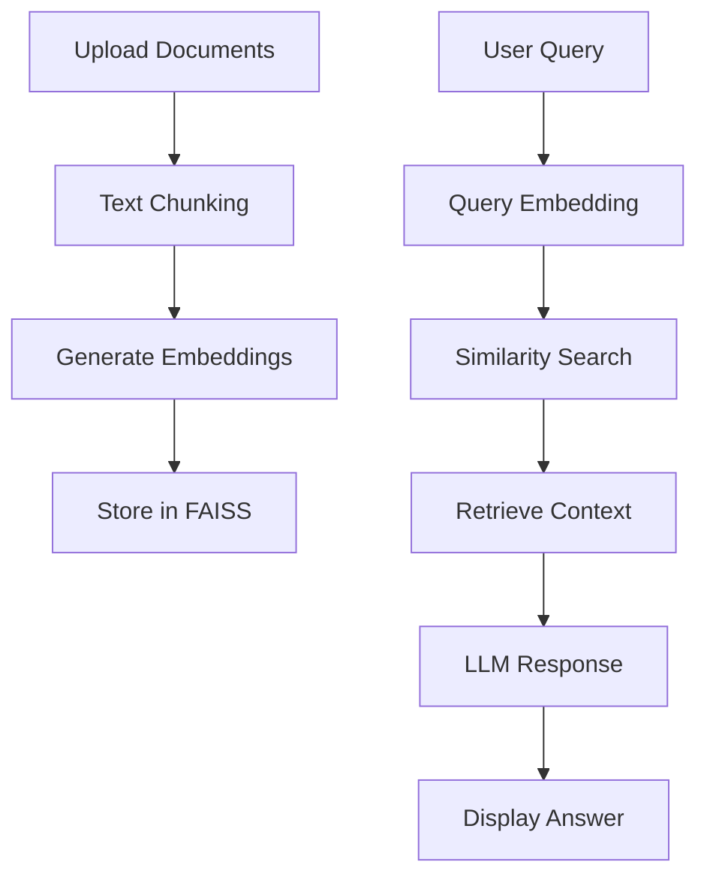

# 🧠 Personal RAG Document Q&A System

[](https://www.python.org/downloads/)
[](https://streamlit.io/)
[](https://opensource.org/licenses/MIT)
[](http://makeapullrequest.com)

A complete **Retrieval-Augmented Generation (RAG)** system that allows you to upload documents and ask intelligent questions about their content. Built with modern AI technologies for semantic search and natural language understanding.


## ✨ Features

- 📄 **Multi-format Document Support**: TXT, PDF, DOCX files
- 🔍 **Semantic Search**: Advanced vector similarity search using FAISS
- 🤖 **Multiple LLM Integration**: OpenAI GPT, Ollama (local), or simple responses
- 🎨 **Beautiful Web Interface**: Clean, responsive UI built with Streamlit
- 💾 **Smart Text Chunking**: Overlapping chunks preserve context
- 📊 **Real-time Analytics**: Track documents, chunks, and conversations
- 💬 **Conversation History**: Keep track of your Q&A sessions
- ⚡ **Fast & Efficient**: Optimized for performance with FAISS vector database

## 🚀 Quick Start

### Prerequisites

- Python 3.8 or higher
- pip package manager

### Installation

1. **Clone the repository**
   ```bash
   [git clone https://github.com/vaibhavi1224/personal-rag-system.git](https://github.com/vaibhavi1224/Personal-RAG-Document-QandA-System.git)
   cd Personal-RAG-Document-QandA-System
   ```

2. **Install dependencies**
   ```bash
   pip install -r requirements.txt
   ```

3. **Run the application**
   ```bash
   streamlit run app.py
   ```

4. **Open your browser** to `http://localhost:8501`

## 📦 Dependencies

```txt
streamlit>=1.28.0
sentence-transformers>=2.2.2
faiss-cpu>=1.7.4
pypdf>=3.16.0
python-docx>=0.8.11
numpy>=1.24.0
pandas>=2.0.0
openai>=1.0.0
requests>=2.31.0
```

## 💡 How It Works

1. **Document Upload**: Upload your documents (TXT, PDF, DOCX)
2. **Text Processing**: Documents are split into overlapping chunks
3. **Vector Embedding**: Each chunk is converted to a vector using sentence-transformers
4. **Storage**: Vectors are stored in FAISS for fast similarity search
5. **Query Processing**: Your questions are embedded and matched against document chunks
6. **Answer Generation**: Relevant context is sent to an LLM for intelligent responses



## 🔧 Configuration

### LLM Providers

#### OpenAI (Recommended)
```bash
# Set your OpenAI API key in the sidebar
# Supports: gpt-3.5-turbo, gpt-4, gpt-4-turbo
```

#### Ollama (Free & Local)
```bash
# Install Ollama
curl -fsSL https://ollama.ai/install.sh | sh

# Pull a model
ollama pull llama2

# Run Ollama server
ollama serve
```

#### No LLM (Basic Mode)
- Uses simple keyword-based responses
- Perfect for testing the retrieval system

### Customization Options

```python
# Adjust chunking strategy
chunker = TextChunker(
    chunk_size=1000,    # Size of each text chunk
    overlap=200         # Overlap between chunks
)

# Use different embedding models
vector_store = VectorStore('all-MiniLM-L6-v2')     # Fast, lightweight
vector_store = VectorStore('all-mpnet-base-v2')    # Higher quality
```

## 📖 Usage Examples

### Basic Usage
1. Upload a document (PDF, TXT, or DOCX)
2. Wait for processing to complete
3. Ask questions about the content
4. Get intelligent, context-aware answers

### Sample Questions
- "What are the main points discussed in this document?"
- "Summarize the key findings"
- "What does the document say about [specific topic]?"
- "Compare the different approaches mentioned"

## 🏗️ Architecture

```
.
├── app.py              # Streamlit app entry point
├── rag/
│   ├── chunking.py     # TextChunker class
│   ├── llm.py          # LLMInterface class
│   ├── processing.py   # DocumentProcessor class
│   ├── store.py        # VectorStore class
│   └── rag_system.py   # RAGSystem orchestration
├── requirements.txt
└── README.md

```

### Core Components

- **DocumentProcessor**: Handles multiple file formats
- **TextChunker**: Smart text segmentation with overlap
- **VectorStore**: FAISS-based similarity search
- **LLMInterface**: Multiple LLM provider support
- **RAGSystem**: Main orchestrator class

## 🚀 Deployment

### Local Development
```bash
streamlit run app.py
```

### Streamlit Cloud
1. Push to GitHub
2. Connect at [share.streamlit.io](https://share.streamlit.io)
3. Add API keys as secrets

## 🔍 Performance

- **Embedding Model**: 384-dimensional vectors (all-MiniLM-L6-v2)
- **Search Speed**: Sub-second queries on 10k+ documents
- **Memory Usage**: ~2GB for 1000 documents
- **Scalability**: Tested with 50MB+ document collections

## 🛠️ Troubleshooting

### Common Issues

1. **FAISS Installation Problems**
   ```bash
   # On Apple Silicon Macs
   conda install faiss-cpu -c conda-forge
   ```

2. **PDF Processing Errors**
   ```bash
   pip install pymupdf  # Alternative PDF processor
   ```

3. **Memory Issues**
   - Reduce chunk_size to 500-750
   - Process documents individually
   - Use smaller embedding models

### Performance Tips

- Use GPU acceleration for large document collections
- Implement document caching for repeated queries
- Consider approximate search for 100k+ documents

## 🔮 Roadmap

- [ ] **Multi-language Support** - Support for non-English documents
- [ ] **Advanced Chunking** - Semantic and structure-aware chunking
- [ ] **Citation Tracking** - Exact source attribution
- [ ] **Batch Processing** - Process multiple documents simultaneously
- [ ] **API Interface** - REST API for programmatic access
- [ ] **Mobile App** - React Native or Flutter interface
- [ ] **Cloud Storage** - Google Drive, Dropbox integration
- [ ] **Collaborative Features** - Share documents and conversations

## 🤝 Contributing

Contributions are welcome! Here's how to get started:

1. **Fork the repository**
2. **Create a feature branch**
   ```bash
   git checkout -b feature/amazing-feature
   ```
3. **Make your changes**
4. **Add tests** (if applicable)
5. **Commit your changes**
   ```bash
   git commit -m 'Add amazing feature'
   ```
6. **Push to the branch**
   ```bash
   git push origin feature/amazing-feature
   ```
7. **Open a Pull Request**

### Development Setup

```bash
# Clone your fork
[git clone https://github.com/yourusername/personal-rag-system.git](https://github.com/vaibhavi1224/Personal-RAG-Document-QandA-System.git)

# Create virtual environment
python -m venv venv
source venv/bin/activate  # On Windows: venv\Scripts\activate

# Install development dependencies
pip install -r requirements.txt
pip install -r requirements-dev.txt  # If you create this
```

## 📝 License

This project is licensed under the MIT License - see the [LICENSE](LICENSE) file for details.

## 🙏 Acknowledgments

- **Sentence Transformers** - For excellent embedding models
- **FAISS** - For lightning-fast similarity search
- **Streamlit** - For the amazing web app framework
- **OpenAI** - For powerful language models
- **Ollama** - For local LLM capabilities

## 📞 Support

- 📧 **Email**: kapsevaibhavi1224@gmail.com
- 💬 **Discussions**: [GitHub Discussions](https://github.com/vaibhavi1224/Personal-RAG-Document-QandA-System/discussions)
- 🐛 **Issues**: [GitHub Issues](https://github.com/vaibhavi1224/Personal-RAG-Document-QandA-System/issues)
- 📖 **Documentation**: [Wiki](https://github.com/vaibhavi1224/Personal-RAG-Document-QandA-System/wiki)


<div align="center">

**Made with ❤️ for the AI community**

[🏠 Home](https://github.com/vaibhavi1224/Personal-RAG-Document-QandA-System) • 
[📖 Docs](https://github.com/vaibhavi1224/Personal-RAG-Document-QandA-System/wiki) • 
[🐛 Report Bug](https://github.com/vaibhavi1224/Personal-RAG-Document-QandA-System/issues) • 
[✨ Request Feature](https://github.com/vaibhavi1224/Personal-RAG-Document-QandA-System/issues)

</div>
